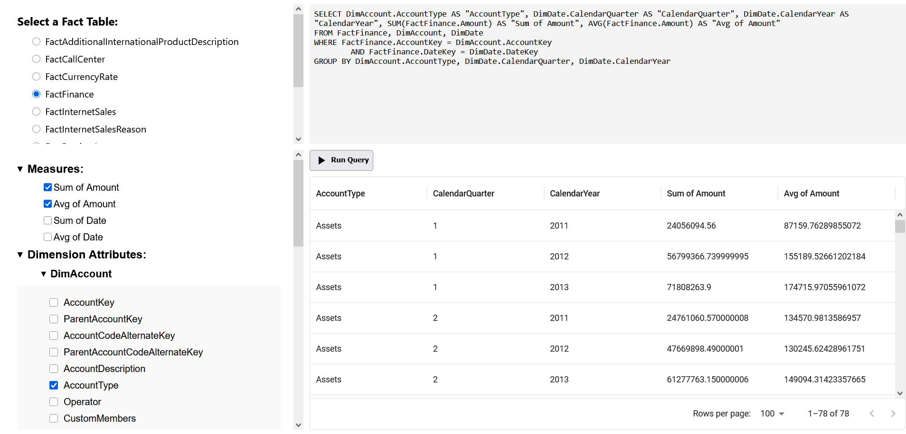

# star-schema-explorer
Star Schema Explorer is a web-based tool for exploring data warehouse schemas using its metadata stored in metadata tables in database. Users can select a fact table, choose specific measures and dimensions, and the system automatically generates the corresponding SQL query. The results are displayed in an interactive interface, making it easy to explore and analyze star-schema-based data models without writing SQL manually.

## Technologies
* Node.js
* React
* MaterialUI
* PostgreSQL

## To-do
* Add more ways to filter data, like specifying ranges or exact values to match
* Add a script that extracts metadata from relational database and fills metadata tables

## Screenshot
 
